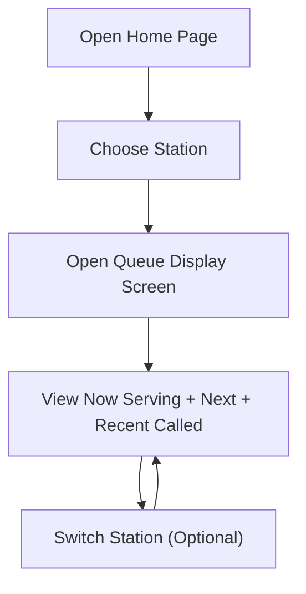

## 1. Product Overview
Queue Display System is a web-based “now serving” screen for clinics to show ticket numbers per station (Dr Station / Nurse Station / Pharmacy) in a clean, full-screen layout.
- Solves the need for a simple, always-on queue screen with station switching and a clear visual hierarchy for the current called number and upcoming items
- Value: reduces confusion and staff workload; a single URL can be opened on TVs/monitors without authentication

## 2. Core Features

### 2.1 User Roles
| Role | Registration Method | Core Permissions |
|------|---------------------|------------------|
| Public Viewer | None | View queue display screens, switch station |

### 2.2 Feature Module
1. **Home Page**: entry point that lets the user open the Queue Display and choose station
2. **Queue Display (叫號屏)**: full-screen display that mimics the layout and visual style of https://build.uno-tech.com.hk/qdisplay/#/ (no login page)

### 2.3 Page Details
| Page Name | Module Name | Feature description |
|-----------|-------------|---------------------|
| Home | Station quick access | Prominent “Queue Display” entry with station dropdown options: Dr Station 醫生診室 / Nurse Station 分流站 / Pharmacy 藥房 |
| Home | Open display action | Opens the display for the selected station (e.g., via route param or querystring) |
| Queue Display | Station header | Shows selected station name in bilingual form (English + Chinese) |
| Queue Display | “Now Serving” block | Large ticket number display, maximized for visibility on a TV |
| Queue Display | “Next” / queue list | Shows upcoming tickets for the selected station (format aligned with the reference design) |
| Queue Display | Recent called (timeline) | Shows recently called tickets as a vertical timeline while keeping each item in a card-like treatment |
| Queue Display | Station switch | Allows switching station without going back to Home (dropdown) |
| Queue Display | Auto refresh | Periodically refreshes data to keep the screen updated (initially mock data, later API-ready) |
| Queue Display | Full-screen readiness | Works well on 1920x1080 displays with responsive scaling; optional kiosk-like “F11” hint |

## 3. Core Process
Primary user flow (public viewer):
- Open Home page
- Choose station from dropdown
- Open Queue Display for that station
- Observe “Now Serving”, upcoming, and recent called items
- Optionally switch station from within the display

## 4. User Interface Design
### 4.1 Design Style
- Reference: replicate the layout, proportions, and overall visual language from https://build.uno-tech.com.hk/qdisplay/#/ (excluding any login-related UI)
- Color direction: high-contrast clinic display theme suitable for TVs (dark background, bright highlight for called number)
- Typography: strong condensed display font for numbers; clean sans font for labels; large sizes for readability at distance
- Layout: station header + primary “Now Serving” focus area + supporting list areas; card-based styling for list items; timeline layout for history list
- Motion: subtle attention cues (e.g., gentle pulse on number changes) without being distracting

### 4.2 Page Design Overview
| Page Name | Module Name | UI Elements |
|-----------|-------------|-------------|
| Home | Station dropdown + entry | Large CTA, dropdown with 3 options, minimal friction, clear bilingual labels |
| Queue Display | Main screen layout | Station title, large “Now Serving” number, “Next” list, recent-called timeline cards, station switch dropdown |

### 4.3 Responsiveness
- Desktop-first, optimized for 16:9 screens (TV/monitor)
- Scales down for smaller screens without breaking hierarchy
- Avoids dense UI; keeps the called number readable from distance
