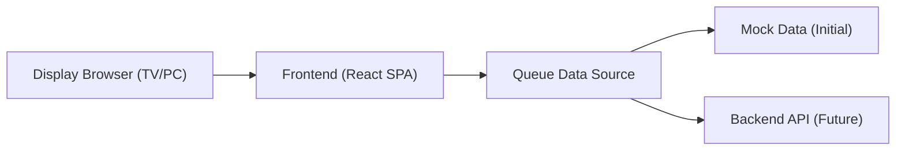
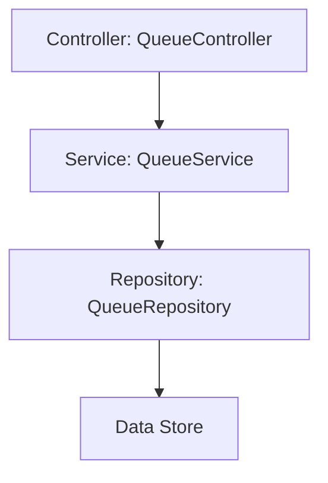
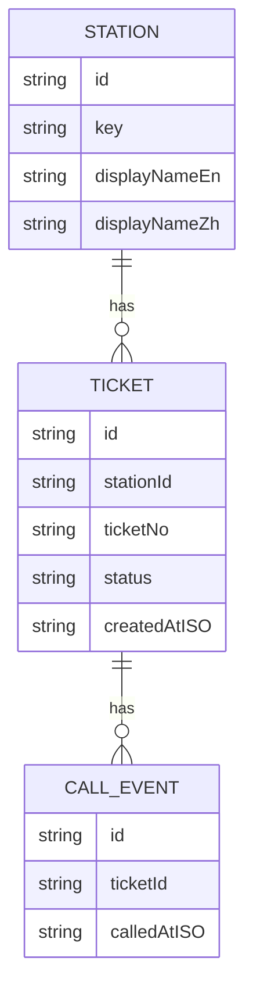

## 1. Architecture Design


## 2. Technology Description
- Frontend: React@18 + TypeScript + Vite
- Styling: Tailwind CSS (utility-first) + small amount of component-level CSS for precise layout matching
- State: React state + lightweight utilities (no heavy global store required for v1)
- Data: mock JSON in v1; API-ready adapter layer for future integration (polling-friendly)
- Backend: None for v1 (frontend-only)

## 3. Route Definitions
| Route | Purpose |
|-------|---------|
| / | Home page (entry point + station selection + open display) |
| /display | Queue display screen; reads station from query (e.g., ?station=dr) |

## 4. API Definitions (Future, if backend exists)
TypeScript-friendly example shapes (not implemented in v1):

```ts
export type StationKey = "dr" | "nurse" | "pharmacy";

export type QueueSnapshot = {
  station: StationKey;
  nowServing: string;
  next: string[];
  recentlyCalled: Array<{
    ticket: string;
    calledAtISO: string;
  }>;
  updatedAtISO: string;
};
```

Potential endpoints:
- GET /api/queue?station=dr -> QueueSnapshot

## 5. Server Architecture Diagram (Future, if backend exists)


## 6. Data Model (Optional)
### 6.1 Data Model Definition (Future)


### 6.2 Data Definition Language (Future)
If a database is introduced later (e.g., SQLite/PostgreSQL), tables can be created based on the ER model above.
